# Performance Analysis of Supervised Learning for Medical Insurance Costs

<center>Author: Jinghui Yao, Qiaolin Liang, Yifan Wang, Ruizhi Xu, Haofei Lai, Yonghao Li</center>

### Abstract

Insurance companies devise health plans based on the insurer's personal conditions. Finding out the factors with higher impact on the insurer’s medical expenditures can help the insurance company to generate more reasonable health plans and subsequently maximize revenue. In this paper, we explore influential factors contributing to each individual’s annual medical expenditure. Using descriptive analysis and supervised learning including multiple linear regression and classification methods, we found that smokers tend to have a higher medical cost while other factors (such as region and obesity) are less impactful. Most importantly, we are able to visualize and predict the medical expenditures spent for each individual based on characteristic features, which might be of interest to insurance companies for future improvements to healthcare plans.

### Introduction

Healthcare is an act of using necessary medical procedures to improve one’s well-being, which may include surgeries, therapies and medications. These services usually are provided by a healthcare system that consists of hospitals and physicians. According to *Time*, currently the medical cost spent per person in the U.S is five times more than that in Canada, and the U.S administrative costs for healthcare came out to $812 billion in 2017. The amount spent in healthcare is significant, not only does each individual pay a lot for their insurance plans, the government has also been devoting resources to medical expenditures for a long time.

Under the healthcare law, insurance companies are not allowed to set the plan for each individual depending on their health, medical history and gender (Healthcare.gov). Therefore, we are interested in what factors contribute more to the medical costs of each individual. Our research questions include the following:

1. How much does obesity or smoking status affect medical expenditures?
2. What is the most significant factor that affects a patient’s medical expenditures?
3. Does the difference in residential regions impact medical costs?
4. Can we predict personal medical expenditures using supervised learning models?

To understand more about the dataset, we first explore the relationships between the dependent variable (medical charges) and each independent variable (number of children, smoking status, BMI, etc.) to visualize the amount of influence of each IV. In order to further explore our research questions, we then build a multiple linear regression model to better understand the underlying relationships between all independent variables and the dependent variable medical cost. We also apply classification to explore our research questions as another approach. We use individual classifiers (including random forest, SVM, naive bayes, and logistic regression) along with an ensemble model and decision tree model to thoroughly study the dataset. Additionally, we build a prediction function using the model with the highest accuracy to predict whether an individual’s medical expenditures will be higher or lower than the mean of log-scale charges.

Load Libraries
--------------

``` r
# Load in necessary libraries
library(tidyverse)
```

    ## ── Attaching packages ──────────────────────────────────────────────────────────────────────────────────────────────────── tidyverse 1.3.0 ──
    
    ## ✓ ggplot2 3.2.1     ✓ purrr   0.3.3
    ## ✓ tibble  2.1.3     ✓ dplyr   0.8.5
    ## ✓ tidyr   1.0.2     ✓ stringr 1.4.0
    ## ✓ readr   1.3.1     ✓ forcats 0.4.0
    
    ## ── Conflicts ─────────────────────────────────────────────────────────────────────────────────────────────────────── tidyverse_conflicts() ──
    ## x dplyr::filter() masks stats::filter()
    ## x dplyr::lag()    masks stats::lag()

``` r
library(stringr)
library(skimr)
library(readr)
library(e1071)
library(tidyr)
library(rcompanion)
library(MASS)
```

    ## 
    ## Attaching package: 'MASS'
    
    ## The following object is masked from 'package:dplyr':
    ## 
    ##     select

``` r
library(performance)
library(ggplot2)
library(GGally)
```

    ## Registered S3 method overwritten by 'GGally':
    ##   method from   
    ##   +.gg   ggplot2
    
    ## 
    ## Attaching package: 'GGally'
    
    ## The following object is masked from 'package:dplyr':
    ## 
    ##     nasa

``` r
library(broom)
```

Load Dataset
------------

``` r
med_ins = read.csv("insurance.csv", header = T)

# Exploration and summary stats
head(med_ins)
```

    ##   age    sex    bmi children smoker    region   charges
    ## 1  19 female 27.900        0    yes southwest 16884.924
    ## 2  18   male 33.770        1     no southeast  1725.552
    ## 3  28   male 33.000        3     no southeast  4449.462
    ## 4  33   male 22.705        0     no northwest 21984.471
    ## 5  32   male 28.880        0     no northwest  3866.855
    ## 6  31 female 25.740        0     no southeast  3756.622

``` r
str(med_ins)
```

    ## 'data.frame':    1338 obs. of  7 variables:
    ##  $ age     : int  19 18 28 33 32 31 46 37 37 60 ...
    ##  $ sex     : Factor w/ 2 levels "female","male": 1 2 2 2 2 1 1 1 2 1 ...
    ##  $ bmi     : num  27.9 33.8 33 22.7 28.9 ...
    ##  $ children: int  0 1 3 0 0 0 1 3 2 0 ...
    ##  $ smoker  : Factor w/ 2 levels "no","yes": 2 1 1 1 1 1 1 1 1 1 ...
    ##  $ region  : Factor w/ 4 levels "northeast","northwest",..: 4 3 3 2 2 3 3 2 1 2 ...
    ##  $ charges : num  16885 1726 4449 21984 3867 ...

``` r
summary(med_ins)
```

    ##       age            sex           bmi           children     smoker    
    ##  Min.   :18.00   female:662   Min.   :15.96   Min.   :0.000   no :1064  
    ##  1st Qu.:27.00   male  :676   1st Qu.:26.30   1st Qu.:0.000   yes: 274  
    ##  Median :39.00                Median :30.40   Median :1.000             
    ##  Mean   :39.21                Mean   :30.66   Mean   :1.095             
    ##  3rd Qu.:51.00                3rd Qu.:34.69   3rd Qu.:2.000             
    ##  Max.   :64.00                Max.   :53.13   Max.   :5.000             
    ##        region       charges     
    ##  northeast:324   Min.   : 1122  
    ##  northwest:325   1st Qu.: 4740  
    ##  southeast:364   Median : 9382  
    ##  southwest:325   Mean   :13270  
    ##                  3rd Qu.:16640  
    ##                  Max.   :63770

From the strustural description of the dataset, we can see that this
medical insurance dataset contains 1338 observations and 7 features,
including age, sex, bmi index, number of children, smoking status,
region of residence within USA, and annual individual medical costs
billed by health insurance. In this regression project, we are trying to
use all the characteristic features to accurately predict annual
healthcare costs of an individual living in the US.

From the summary statistics of the dataset, we can see that the
respondents are between 18-64 years old, having 0-5 children, with an
annual medical costs between $1,122 and $63,770 (mean value is $13,270).

Descriptive Analysis
====================

EDA (plots optional)
--------------------

``` r
# EDA
ggplot(data = med_ins, aes(as.factor(children),charges)) + 
  geom_boxplot(fill = c(1:6)) +
  theme_minimal() +  
  xlab("Number of Children") +
  ylab("Healthcare Costs(USD)") +
  ggtitle("Boxplot of Medical Charges by Number of Children")
```

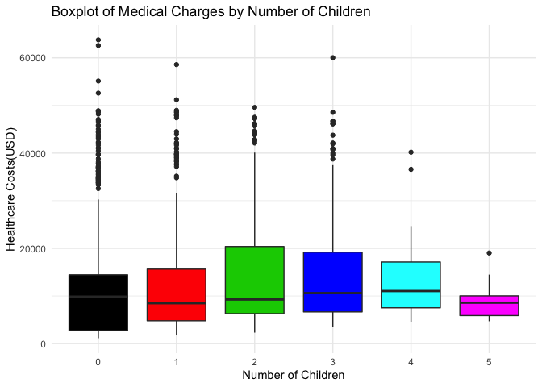

``` r
ggplot(data = med_ins, aes(smoker,charges)) + 
  geom_boxplot(fill = c(1:2)) +
  theme_minimal() + 
  xlab("Smoking Status") +
  ylab("Healthcare Costs(USD)") +
  ggtitle("Boxplot of Medical Charges by Smoking Status")
```

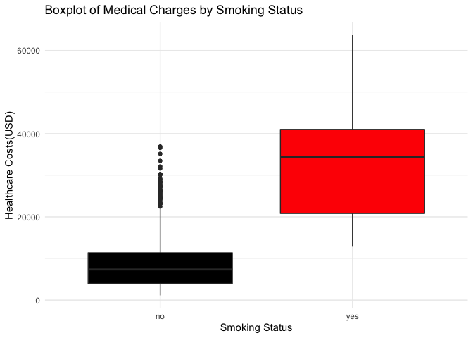
From the first boxplot, we can see that, surprisingly, respondents with
2-4 children have higher medical bills on average, but respondents with
5 children tend to have lower medical costs (could be a result of
government support or other factors).

The second boxplot indicates clearly that respondents who smoke have an
average healthcare cost that is almost 4 times higher than those who do
not smoke. Smoking status seems to have a large impact on individual
medical costs.

``` r
# Check and confirm no missing values
med_ins %>% summarise_all(.funs = funs(sum(is.na(.))))
```

    ## Warning: funs() is soft deprecated as of dplyr 0.8.0
    ## Please use a list of either functions or lambdas: 
    ## 
    ##   # Simple named list: 
    ##   list(mean = mean, median = median)
    ## 
    ##   # Auto named with `tibble::lst()`: 
    ##   tibble::lst(mean, median)
    ## 
    ##   # Using lambdas
    ##   list(~ mean(., trim = .2), ~ median(., na.rm = TRUE))
    ## This warning is displayed once per session.
    
    ##   age sex bmi children smoker region charges
    ## 1   0   0   0        0      0      0       0

Transform the gender and smoking status to factors where Gender 0:
Female 1: Male

Smoker 0: Non-Smoker 1: Smoker

Correlation Analysis
--------------------

``` r
# Convert categorical features to numeric for correlation analysis
num_med_ins <- med_ins # create a new duplicate dataset for correlation
unique(num_med_ins$sex)
```

    ## [1] female male  
    ## Levels: female male

``` r
num_med_ins$sex <- ifelse(num_med_ins$sex == "male", 1, 0)
unique(num_med_ins$smoker)
```

    ## [1] yes no 
    ## Levels: no yes

``` r
num_med_ins$smoker <- ifelse(num_med_ins$smoker == "yes", 1, 0)
unique(num_med_ins$region)
```

    ## [1] southwest southeast northwest northeast
    ## Levels: northeast northwest southeast southwest

``` r
num_med_ins$region <- dplyr::case_when(
  num_med_ins$region == "northeast" ~ 1,
  num_med_ins$region == "northwest" ~ 2,
  num_med_ins$region == "southeast" ~ 3,
  TRUE ~ 4
)
str(num_med_ins)
```

    ## 'data.frame':    1338 obs. of  7 variables:
    ##  $ age     : int  19 18 28 33 32 31 46 37 37 60 ...
    ##  $ sex     : num  0 1 1 1 1 0 0 0 1 0 ...
    ##  $ bmi     : num  27.9 33.8 33 22.7 28.9 ...
    ##  $ children: int  0 1 3 0 0 0 1 3 2 0 ...
    ##  $ smoker  : num  1 0 0 0 0 0 0 0 0 0 ...
    ##  $ region  : num  4 3 3 2 2 3 3 2 1 2 ...
    ##  $ charges : num  16885 1726 4449 21984 3867 ...

``` r
# Check for multicollinearity assumption
ggpairs(num_med_ins, progress = FALSE) +
  theme(panel.grid.major = element_blank())
```

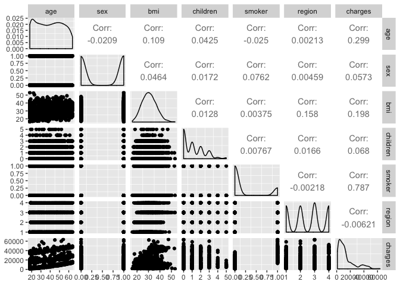

``` r
# The correlation plots indicate that none of the variables are highly correlated with
# one another, thus it is safe to say that the dataset does not have a multicollinearity problem.
```

``` r
# General distribution of medical charges
skewness(med_ins$charges)
```

    ## [1] 1.512483

``` r
plotNormalHistogram(med_ins$charges,
                    main = "Figure 1: Normal Histogram of Medical Charges Distribution",
                    xlab="Medical Charges (USD)",
                    ylab="Number of Respondents")
```

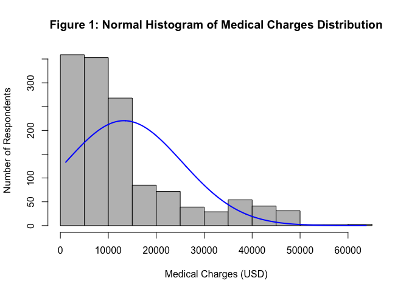

``` r
# We need to correct for the positive skewness within the distribution
# before continuing with Linear Regression Modeling

plotNormalHistogram(log(med_ins$charges),
                    main = "Figure 1: Normal Histogram of Log-Scale Medical Charges Distribution",
                    xlab="Medical Charges (USD)",
                    ylab="Number of Respondents")
```

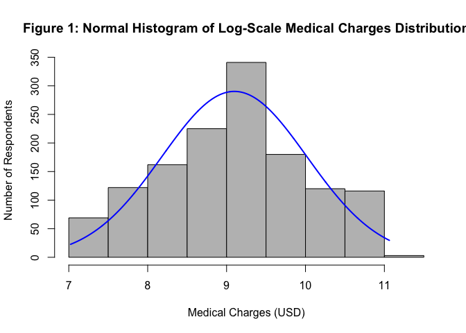

``` r
# The log-scale transformation leads to a normalized distribution
# of medical charges.
```

Linear Regression Model
=======================

Full Model and Feature Selection
--------------------------------

``` r
# Backward Selection
log_med_ins <- med_ins # create a new duplicate dataset for linear regression
log_med_ins$log_charges = log(log_med_ins$charges)
log_med_ins <- log_med_ins %>% dplyr::select(-7)
full <- lm(log_charges ~ ., data = log_med_ins)
stepB <- stepAIC(full, direction = "backward", trace=TRUE)
```

    ## Start:  AIC=-2162.05
    ## log_charges ~ age + sex + bmi + children + smoker + region
    ## 
    ##            Df Sum of Sq    RSS      AIC
    ## <none>                  262.33 -2162.05
    ## - sex       1      1.89 264.21 -2154.46
    ## - region    3      4.68 267.01 -2144.38
    ## - bmi       1      8.04 270.37 -2123.67
    ## - children  1     20.08 282.41 -2065.37
    ## - age       1    310.40 572.73 -1119.31
    ## - smoker    1    520.12 782.45  -701.83

``` r
summary(stepB)
```

    ## 
    ## Call:
    ## lm(formula = log_charges ~ age + sex + bmi + children + smoker + 
    ##     region, data = log_med_ins)
    ## 
    ## Residuals:
    ##      Min       1Q   Median       3Q      Max 
    ## -1.07186 -0.19835 -0.04917  0.06598  2.16636 
    ## 
    ## Coefficients:
    ##                   Estimate Std. Error t value Pr(>|t|)    
    ## (Intercept)      7.0305581  0.0723960  97.112  < 2e-16 ***
    ## age              0.0345816  0.0008721  39.655  < 2e-16 ***
    ## sexmale         -0.0754164  0.0244012  -3.091 0.002038 ** 
    ## bmi              0.0133748  0.0020960   6.381 2.42e-10 ***
    ## children         0.1018568  0.0100995  10.085  < 2e-16 ***
    ## smokeryes        1.5543228  0.0302795  51.333  < 2e-16 ***
    ## regionnorthwest -0.0637876  0.0349057  -1.827 0.067860 .  
    ## regionsoutheast -0.1571967  0.0350828  -4.481 8.08e-06 ***
    ## regionsouthwest -0.1289522  0.0350271  -3.681 0.000241 ***
    ## ---
    ## Signif. codes:  0 '***' 0.001 '**' 0.01 '*' 0.05 '.' 0.1 ' ' 1
    ## 
    ## Residual standard error: 0.4443 on 1329 degrees of freedom
    ## Multiple R-squared:  0.7679, Adjusted R-squared:  0.7666 
    ## F-statistic: 549.8 on 8 and 1329 DF,  p-value: < 2.2e-16

``` r
# Using feature selection, we can see that all predictors are significant at alpha 
# level = 0.05, so we will keep all variables for the following linear regression model.
```

Assumptions Test
----------------

``` r
plot(full)
```

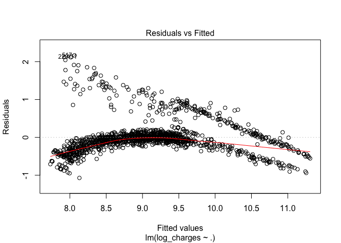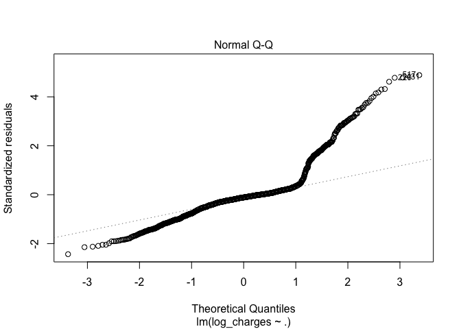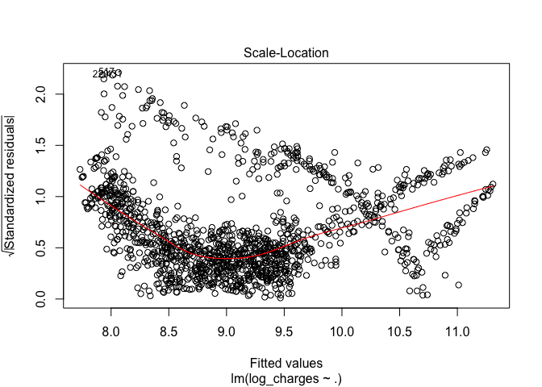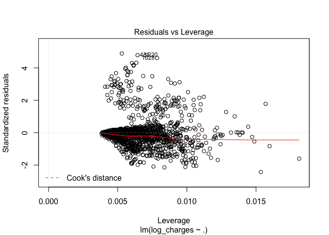

``` r
str(log_med_ins)
```

    ## 'data.frame':    1338 obs. of  7 variables:
    ##  $ age        : int  19 18 28 33 32 31 46 37 37 60 ...
    ##  $ sex        : Factor w/ 2 levels "female","male": 1 2 2 2 2 1 1 1 2 1 ...
    ##  $ bmi        : num  27.9 33.8 33 22.7 28.9 ...
    ##  $ children   : int  0 1 3 0 0 0 1 3 2 0 ...
    ##  $ smoker     : Factor w/ 2 levels "no","yes": 2 1 1 1 1 1 1 1 1 1 ...
    ##  $ region     : Factor w/ 4 levels "northeast","northwest",..: 4 3 3 2 2 3 3 2 1 2 ...
    ##  $ log_charges: num  9.73 7.45 8.4 10 8.26 ...

``` r
# Plots indicate that the model cannot satisfy all 4 assumptions
# we need to explore transformations of the model
```

Transformations of Linear Model
-------------------------------

``` r
# Use box-cox transformation
skewness(full$residuals)
```

    ## [1] 1.676638

``` r
b <- boxcox(full)
```

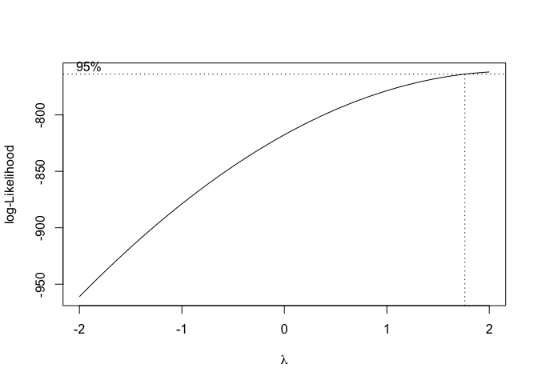

``` r
lambda <- b$x
lik <- b$y
df <- cbind.data.frame(lambda,lik)
which.max(df$lik)
```

    ## [1] 100

``` r
maxlambda <- df$lambda[which.max(df$lik)]
maxlambda
```

    ## [1] 2

``` r
# Update original model with lambda
med_model2 <- lm(log_charges^2 ~ ., data = log_med_ins)
plot(med_model2)
```

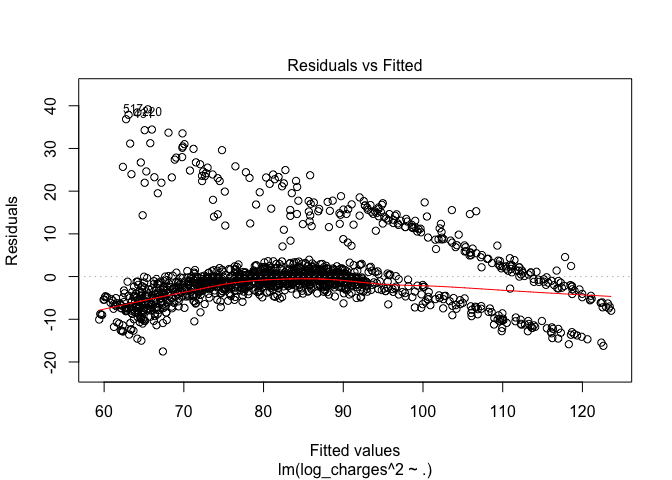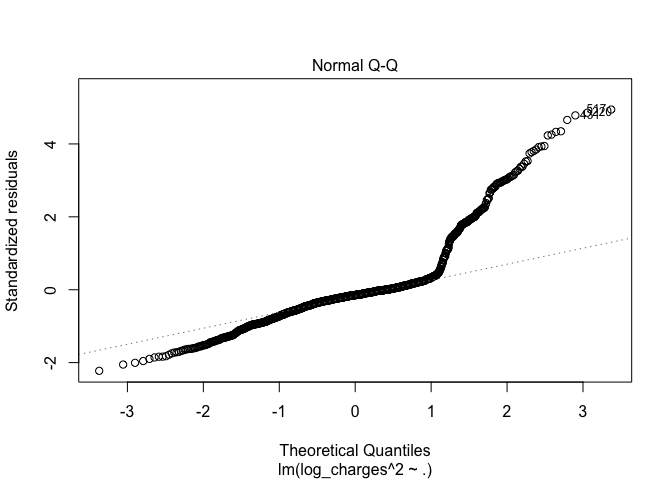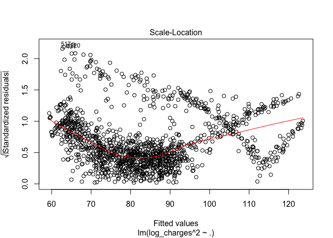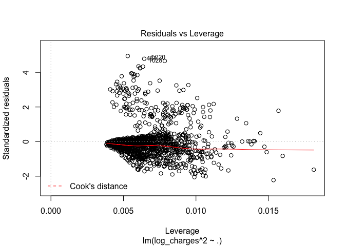

``` r
# Remove influential points
p <- length(med_model2$coefficients)
n <- nrow(med_model2$model)
dffits_crit = 2 * sqrt((p + 1) / (n - p - 1))
model2_dffits <- dffits(med_model2)

# Build a log-scale linear regression model 
med_model3 <- lm(log_charges^2 ~ ., 
                 data = log_med_ins[-which(abs(model2_dffits) > dffits_crit),])
model_performance(med_model3)
```

    ## # Indices of model performance
    ## 
    ##       AIC      BIC    R2 R2_adjusted  RMSE
    ##  7469.971 7521.216 0.911        0.91 4.856

``` r
check_model(med_model3)
```

    ## `stat_bin()` using `bins = 30`. Pick better value with `binwidth`.
    
    ## Warning: Removed 1242 rows containing missing values (geom_text_repel).

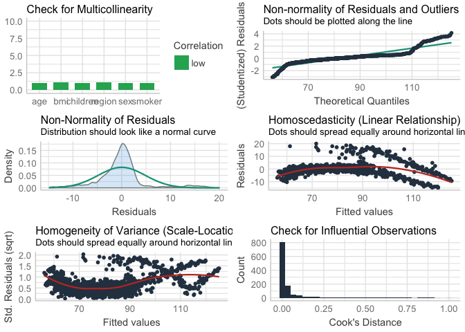

``` r
summary(med_model3)
```

    ## 
    ## Call:
    ## lm(formula = log_charges^2 ~ ., data = log_med_ins[-which(abs(model2_dffits) > 
    ##     dffits_crit), ])
    ## 
    ## Residuals:
    ##      Min       1Q   Median       3Q      Max 
    ## -14.8737  -1.9586  -0.0598   1.4294  20.0290 
    ## 
    ## Coefficients:
    ##                 Estimate Std. Error t value Pr(>|t|)    
    ## (Intercept)     42.60047    0.81873  52.033  < 2e-16 ***
    ## age              0.68982    0.01012  68.151  < 2e-16 ***
    ## sexmale         -1.31257    0.27781  -4.725 2.57e-06 ***
    ## bmi              0.21233    0.02417   8.785  < 2e-16 ***
    ## children         1.84613    0.11536  16.003  < 2e-16 ***
    ## smokeryes       30.07966    0.35061  85.791  < 2e-16 ***
    ## regionnorthwest -1.43875    0.39914  -3.605 0.000325 ***
    ## regionsoutheast -2.44084    0.40132  -6.082 1.58e-09 ***
    ## regionsouthwest -1.95649    0.39850  -4.910 1.03e-06 ***
    ## ---
    ## Signif. codes:  0 '***' 0.001 '**' 0.01 '*' 0.05 '.' 0.1 ' ' 1
    ## 
    ## Residual standard error: 4.874 on 1233 degrees of freedom
    ## Multiple R-squared:  0.9111, Adjusted R-squared:  0.9105 
    ## F-statistic:  1579 on 8 and 1233 DF,  p-value: < 2.2e-16

By assigning weights to update the log-scale model, we end up with a
third model with an adjusted R-squared of 0.9105, indicating that the
predictors in this model explain 91.05% of variance in medical charges.

The model performance statistics indicates an RMSE of 4.856, which is
acceptable.

When checking the model, we found that the updated model still does not
satisfy the constant variance assumption: - Low correlation indicates
that there is no multicollinearity between the numeric variables; -
Distribution of residuals roughly follows a normal curve; - Residuals
spread roughly along both sides of the red line in the homoscedasticity
plot, however, the red line does not seem to be horizontal even after
several transformations. The residual points seem to follow a weird
downward curve, suggesting that they do not satisfy the constant
variance assumption; - There are no obvious outliers in the model,
residuals mostly followthe line in the QQ plot (change of pattern at the
end could be explained by the right-skewed distribution of medical
charges); - There are no influential points exceeding Cook’s Distance.

Because of these findings, we suspect that there are non-linear
relationships within the dataset, rendering the linear regression models
to be less than useful. Thus, we shift our focus to building
classification algorithms.

Classification Models
=====================

Re-code Factors and Assign Charge Levels
----------------------------------------

``` r
library(dplyr)

# Create new duplicate dataset for classification manipulations
med_ins2 = read.csv("insurance.csv", header = T)

med_ins2$sex <- ifelse(med_ins2$sex == "male", 1, 0)
med_ins2$smoker <- ifelse(med_ins2$smoker == "yes", 1, 0)
med_ins2$region <- dplyr::case_when(
  med_ins2$region == "northeast" ~ 1,
  med_ins2$region == "northwest" ~ 2,
  med_ins2$region == "southeast" ~ 3,
  TRUE ~ 4
)

# Categorized by mean of log-scale of charges (2 levels)
med_ins2 <- med_ins2 %>% mutate(log_charge = log(charges))
mean_log_charges <- mean(med_ins2$log_charge)
med_ins2$charge_level <- ifelse(med_ins2$log_charge >= mean_log_charges, "High", "Low")
length(which(med_ins2$charge_level == "High")) # 696
```

    ## [1] 696

``` r
length(which(med_ins2$charge_level == "Low")) # 642
```

    ## [1] 642

``` r
med_ins2 <- med_ins2 %>% 
  dplyr::select(-c(7,8)) %>% 
  as.data.frame()


str(med_ins2)
```

    ## 'data.frame':    1338 obs. of  7 variables:
    ##  $ age         : int  19 18 28 33 32 31 46 37 37 60 ...
    ##  $ sex         : num  0 1 1 1 1 0 0 0 1 0 ...
    ##  $ bmi         : num  27.9 33.8 33 22.7 28.9 ...
    ##  $ children    : int  0 1 3 0 0 0 1 3 2 0 ...
    ##  $ smoker      : num  1 0 0 0 0 0 0 0 0 0 ...
    ##  $ region      : num  4 3 3 2 2 3 3 2 1 2 ...
    ##  $ charge_level: chr  "High" "Low" "Low" "High" ...

Divide dataset into training and testing (70:30)
------------------------------------------------

``` r
set.seed(123)
new_train <- sample(nrow(med_ins2),as.integer(nrow(med_ins2)*0.70))
train_set_ins = med_ins2[new_train,]
test_set_ins = med_ins2[-new_train,]
train_labels_ins <- train_set_ins[,7]
test_labels_ins <- test_set_ins[, 7]
test_set_ins <- test_set_ins[,-7]
```

Random Forest Classifier
------------------------

``` r
library(caret)
```

    ## Loading required package: lattice
    
    ## 
    ## Attaching package: 'caret'
    
    ## The following object is masked from 'package:purrr':
    ## 
    ##     lift

``` r
ctrl <- trainControl(method="repeatedcv", number = 5, repeats = 3)
set.seed(123)
RFmodel_ins <- train(charge_level ~ ., data = train_set_ins, method="rf", ntree=500, trControl = ctrl)
test_predRF_ins <- predict(RFmodel_ins, test_set_ins)
cf_RF_ins <- confusionMatrix(as.factor(test_predRF_ins), as.factor(test_labels_ins),
                             mode = "everything")
print(cf_RF_ins)
```

    ## Confusion Matrix and Statistics
    ## 
    ##           Reference
    ## Prediction High Low
    ##       High  177   7
    ##       Low    19 199
    ##                                           
    ##                Accuracy : 0.9353          
    ##                  95% CI : (0.9067, 0.9573)
    ##     No Information Rate : 0.5124          
    ##     P-Value [Acc > NIR] : < 2e-16         
    ##                                           
    ##                   Kappa : 0.8704          
    ##                                           
    ##  Mcnemar's Test P-Value : 0.03098         
    ##                                           
    ##             Sensitivity : 0.9031          
    ##             Specificity : 0.9660          
    ##          Pos Pred Value : 0.9620          
    ##          Neg Pred Value : 0.9128          
    ##               Precision : 0.9620          
    ##                  Recall : 0.9031          
    ##                      F1 : 0.9316          
    ##              Prevalence : 0.4876          
    ##          Detection Rate : 0.4403          
    ##    Detection Prevalence : 0.4577          
    ##       Balanced Accuracy : 0.9345          
    ##                                           
    ##        'Positive' Class : High            
    ## 

``` r
# Using log + mean to categorize: accuracy = 0.9353, F1 = 0.9316
```

SVM Classifier
--------------

``` r
set.seed(123)
SVMmodel_ins <- train(charge_level ~ ., data = train_set_ins, method="svmPoly", trControl = ctrl)
test_predSVM_ins <- predict(SVMmodel_ins, test_set_ins)
cf_SVM_ins <- confusionMatrix(as.factor(test_predSVM_ins), as.factor(test_labels_ins),
                              mode = "everything")
print(cf_SVM_ins)
```

    ## Confusion Matrix and Statistics
    ## 
    ##           Reference
    ## Prediction High Low
    ##       High  176   7
    ##       Low    20 199
    ##                                           
    ##                Accuracy : 0.9328          
    ##                  95% CI : (0.9038, 0.9553)
    ##     No Information Rate : 0.5124          
    ##     P-Value [Acc > NIR] : < 2e-16         
    ##                                           
    ##                   Kappa : 0.8654          
    ##                                           
    ##  Mcnemar's Test P-Value : 0.02092         
    ##                                           
    ##             Sensitivity : 0.8980          
    ##             Specificity : 0.9660          
    ##          Pos Pred Value : 0.9617          
    ##          Neg Pred Value : 0.9087          
    ##               Precision : 0.9617          
    ##                  Recall : 0.8980          
    ##                      F1 : 0.9288          
    ##              Prevalence : 0.4876          
    ##          Detection Rate : 0.4378          
    ##    Detection Prevalence : 0.4552          
    ##       Balanced Accuracy : 0.9320          
    ##                                           
    ##        'Positive' Class : High            
    ## 

``` r
# Using log + mean to categorize: accuracy = 0.9328, F1 = 0.9288
```

Naive Bayes Classifier
----------------------

``` r
set.seed(123)
NBmodel_ins <- train(charge_level ~ ., data = train_set_ins, method="naive_bayes", trControl = ctrl)
test_predNB_ins <- predict(NBmodel_ins, test_set_ins)
cf_NB_ins <- confusionMatrix(as.factor(test_predNB_ins), as.factor(test_labels_ins),
                              mode = "everything")
print(cf_NB_ins)
```

    ## Confusion Matrix and Statistics
    ## 
    ##           Reference
    ## Prediction High Low
    ##       High  181  28
    ##       Low    15 178
    ##                                           
    ##                Accuracy : 0.893           
    ##                  95% CI : (0.8586, 0.9215)
    ##     No Information Rate : 0.5124          
    ##     P-Value [Acc > NIR] : < 2e-16         
    ##                                           
    ##                   Kappa : 0.7863          
    ##                                           
    ##  Mcnemar's Test P-Value : 0.06725         
    ##                                           
    ##             Sensitivity : 0.9235          
    ##             Specificity : 0.8641          
    ##          Pos Pred Value : 0.8660          
    ##          Neg Pred Value : 0.9223          
    ##               Precision : 0.8660          
    ##                  Recall : 0.9235          
    ##                      F1 : 0.8938          
    ##              Prevalence : 0.4876          
    ##          Detection Rate : 0.4502          
    ##    Detection Prevalence : 0.5199          
    ##       Balanced Accuracy : 0.8938          
    ##                                           
    ##        'Positive' Class : High            
    ## 

``` r
# Using log + mean to categorize: accuracy = 0.8930, F1 = 0.8938
```

Logistic Regression Classifier
------------------------------

``` r
set.seed(123)
LRmodel_ins <- train(charge_level ~ ., data = train_set_ins, method="glm", trControl = ctrl)
test_predLR_ins <- predict(LRmodel_ins, test_set_ins)
cf_LR_ins <- confusionMatrix(as.factor(test_predLR_ins), as.factor(test_labels_ins),
                              mode = "everything")
print(cf_LR_ins)
```

    ## Confusion Matrix and Statistics
    ## 
    ##           Reference
    ## Prediction High Low
    ##       High  178  24
    ##       Low    18 182
    ##                                           
    ##                Accuracy : 0.8955          
    ##                  95% CI : (0.8614, 0.9237)
    ##     No Information Rate : 0.5124          
    ##     P-Value [Acc > NIR] : <2e-16          
    ##                                           
    ##                   Kappa : 0.7911          
    ##                                           
    ##  Mcnemar's Test P-Value : 0.4404          
    ##                                           
    ##             Sensitivity : 0.9082          
    ##             Specificity : 0.8835          
    ##          Pos Pred Value : 0.8812          
    ##          Neg Pred Value : 0.9100          
    ##               Precision : 0.8812          
    ##                  Recall : 0.9082          
    ##                      F1 : 0.8945          
    ##              Prevalence : 0.4876          
    ##          Detection Rate : 0.4428          
    ##    Detection Prevalence : 0.5025          
    ##       Balanced Accuracy : 0.8958          
    ##                                           
    ##        'Positive' Class : High            
    ## 

``` r
# Using log + mean to categorize: accuracy = 0.8955, F1 = 0.8945
```

Ensemble Model
--------------

``` r
library(caret)
library(caretEnsemble)
```

    ## 
    ## Attaching package: 'caretEnsemble'
    
    ## The following object is masked from 'package:ggplot2':
    ## 
    ##     autoplot

``` r
control=trainControl(method="repeatedcv", number = 5, repeats = 3, savePredictions="final", classProbs=TRUE)
algorithmList=c('rf', 'svmPoly', 'glm', 'naive_bayes')
set.seed(123)
models1=caretList(charge_level ~ ., data = train_set_ins, trControl=control, methodList=algorithmList)
```

    ## Warning in trControlCheck(x = trControl, y = target): indexes not defined in
    ## trControl. Attempting to set them ourselves, so each model in the ensemble will
    ## have the same resampling indexes.

``` r
results1=resamples(models1)
summary(results1)
```

    ## 
    ## Call:
    ## summary.resamples(object = results1)
    ## 
    ## Models: rf, svmPoly, glm, naive_bayes 
    ## Number of resamples: 15 
    ## 
    ## Accuracy 
    ##                  Min.   1st Qu.    Median      Mean   3rd Qu.      Max. NA's
    ## rf          0.9090909 0.9197861 0.9304813 0.9351879 0.9518717 0.9680851    0
    ## svmPoly     0.8983957 0.9200137 0.9251337 0.9280654 0.9358289 0.9572193    0
    ## glm         0.8670213 0.8986802 0.9144385 0.9138355 0.9304813 0.9465241    0
    ## naive_bayes 0.8609626 0.8773325 0.8877005 0.8910361 0.9066731 0.9304813    0
    ## 
    ## Kappa 
    ##                  Min.   1st Qu.    Median      Mean   3rd Qu.      Max. NA's
    ## rf          0.8187881 0.8393931 0.8616313 0.8706045 0.9036356 0.9361702    0
    ## svmPoly     0.7965646 0.8397792 0.8506560 0.8558941 0.8717048 0.9141513    0
    ## glm         0.7320410 0.7966020 0.8285583 0.8268342 0.8605998 0.8928490    0
    ## naive_bayes 0.7176211 0.7534233 0.7738034 0.7802598 0.8110961 0.8599735    0

``` r
dotplot(results1)  
```

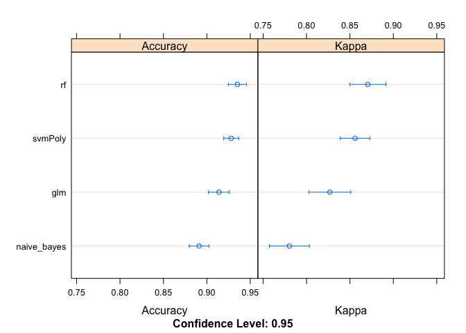

``` r
modelCor(results1)
```

    ##                    rf   svmPoly       glm naive_bayes
    ## rf          1.0000000 0.7291009 0.5810690   0.3208968
    ## svmPoly     0.7291009 1.0000000 0.7796289   0.5526832
    ## glm         0.5810690 0.7796289 1.0000000   0.4398411
    ## naive_bayes 0.3208968 0.5526832 0.4398411   1.0000000

``` r
# Using log of mean charges to categorize: SVM & glm are highly correlated (>0.75), 
# remove glm from the ensemble model because of its lower accuracy.
```

Update Ensemble Model
---------------------

``` r
library(caretEnsemble)

control=trainControl(method="repeatedcv", number = 5, repeats=3, savePredictions="final", classProbs=TRUE)
algorithmList=c('rf', 'svmPoly', 'naive_bayes')
set.seed(123)
models2=caretList(charge_level ~ ., data=train_set_ins, trControl=control, methodList=algorithmList)
```

    ## Warning in trControlCheck(x = trControl, y = target): indexes not defined in
    ## trControl. Attempting to set them ourselves, so each model in the ensemble will
    ## have the same resampling indexes.

``` r
set.seed(123)
results2=resamples(models2)
summary(results2)
```

    ## 
    ## Call:
    ## summary.resamples(object = results2)
    ## 
    ## Models: rf, svmPoly, naive_bayes 
    ## Number of resamples: 15 
    ## 
    ## Accuracy 
    ##                  Min.   1st Qu.    Median      Mean   3rd Qu.      Max. NA's
    ## rf          0.9090909 0.9197861 0.9304813 0.9351879 0.9518717 0.9680851    0
    ## svmPoly     0.8983957 0.9200137 0.9251337 0.9280654 0.9358289 0.9572193    0
    ## naive_bayes 0.8609626 0.8773325 0.8877005 0.8910361 0.9066731 0.9304813    0
    ## 
    ## Kappa 
    ##                  Min.   1st Qu.    Median      Mean   3rd Qu.      Max. NA's
    ## rf          0.8187881 0.8393931 0.8616313 0.8706045 0.9036356 0.9361702    0
    ## svmPoly     0.7965646 0.8397792 0.8506560 0.8558941 0.8717048 0.9141513    0
    ## naive_bayes 0.7176211 0.7534233 0.7738034 0.7802598 0.8110961 0.8599735    0

``` r
dotplot(results2)  
```

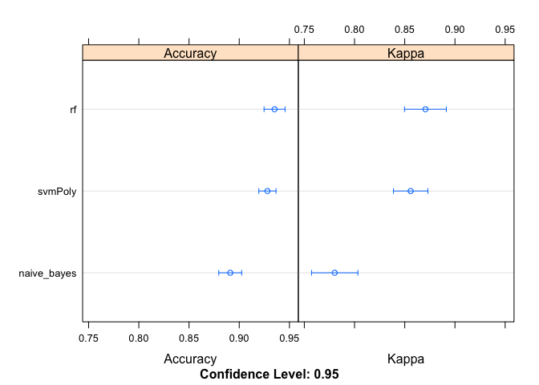

``` r
modelCor(results2)
```

    ##                    rf   svmPoly naive_bayes
    ## rf          1.0000000 0.7291009   0.3208968
    ## svmPoly     0.7291009 1.0000000   0.5526832
    ## naive_bayes 0.3208968 0.5526832   1.0000000

Combine Predictions of Models Using Caret Stack with RF
-------------------------------------------------------

``` r
stackControl=trainControl(method="repeatedcv", number=5, repeats=3, savePredictions=TRUE, classProbs=TRUE)
set.seed(123)
stack_rf=caretStack(models2, method="rf", metric="Accuracy", trControl=stackControl)
```

    ## note: only 2 unique complexity parameters in default grid. Truncating the grid to 2 .

``` r
print(stack_rf)
```

    ## A rf ensemble of 3 base models: rf, svmPoly, naive_bayes
    ## 
    ## Ensemble results:
    ## Random Forest 
    ## 
    ## 2808 samples
    ##    3 predictor
    ##    2 classes: 'High', 'Low' 
    ## 
    ## No pre-processing
    ## Resampling: Cross-Validated (5 fold, repeated 3 times) 
    ## Summary of sample sizes: 2246, 2247, 2246, 2246, 2247, 2246, ... 
    ## Resampling results across tuning parameters:
    ## 
    ##   mtry  Accuracy   Kappa    
    ##   2     0.9342396  0.8686197
    ##   3     0.9332896  0.8666993
    ## 
    ## Accuracy was used to select the optimal model using the largest value.
    ## The final value used for the model was mtry = 2.

Check stack.rf Performance
--------------------------

``` r
stack_pred=predict(stack_rf, test_set_ins)
cf_ensemble=confusionMatrix(as.factor(stack_pred), as.factor(test_labels_ins), mode = "everything")
print(cf_ensemble)
```

    ## Confusion Matrix and Statistics
    ## 
    ##           Reference
    ## Prediction High Low
    ##       High  177   4
    ##       Low    19 202
    ##                                           
    ##                Accuracy : 0.9428          
    ##                  95% CI : (0.9154, 0.9634)
    ##     No Information Rate : 0.5124          
    ##     P-Value [Acc > NIR] : < 2.2e-16       
    ##                                           
    ##                   Kappa : 0.8853          
    ##                                           
    ##  Mcnemar's Test P-Value : 0.003509        
    ##                                           
    ##             Sensitivity : 0.9031          
    ##             Specificity : 0.9806          
    ##          Pos Pred Value : 0.9779          
    ##          Neg Pred Value : 0.9140          
    ##               Precision : 0.9779          
    ##                  Recall : 0.9031          
    ##                      F1 : 0.9390          
    ##              Prevalence : 0.4876          
    ##          Detection Rate : 0.4403          
    ##    Detection Prevalence : 0.4502          
    ##       Balanced Accuracy : 0.9418          
    ##                                           
    ##        'Positive' Class : High            
    ## 

``` r
# Using mean to categorize: The ensemble model has an accuracy of 0.9428, with an F1 score of 0.9390.
# Ensemble model has a higher accuracy and F1 score than the other solo classifiers.
```

Decision Tree Model
-------------------

``` r
library(rpart)
library(rpart.plot)
library(dplyr)
library(caret)

# Create new duplicate dataset for Decision Tree
med_ins3 = read.csv("insurance.csv", header = T)

# Transform all variables into factors
med_ins3$age <- dplyr::case_when(
  med_ins3$age <= 30 ~ "Younger Age (Under 30)",
  med_ins3$age >= 60 ~ "Older Age (Over 60)",
  TRUE ~ "Middle Age (30-60)"
) %>% 
  as.factor()
med_ins3$bmi <- dplyr::case_when(
  med_ins3$bmi < 18.5 ~ "Underweight",
  med_ins3$bmi >= 18.5 & med_ins3$bmi < 25 ~ "Healthy",
  med_ins3$bmi >= 25 & med_ins3$bmi < 30 ~ "Overweight",
  med_ins3$bmi >= 30 ~ "Obese",
  TRUE ~ "Unhealthy"
) %>% 
  as.factor()
med_ins3$children <- as.factor(med_ins3$children)

# Categorized by mean of log-scale of charges (2 levels)
med_ins3 <- med_ins3 %>% mutate(log_charge = log(charges))
mean_log_charges <- mean(med_ins3$log_charge)
med_ins3$charge_level <- ifelse(med_ins3$log_charge >= mean_log_charges, "High", "Low")

# Remove unnecessary columns containing charges
med_ins3 <- med_ins3 %>% dplyr::select(-c(7,8))

# Divide dataset into 70:30 train and test sets
set.seed(123)
dt_train <- sample(nrow(med_ins3), as.integer(nrow(med_ins3)*0.70))
train_set_dt = med_ins3[dt_train,]
test_set_dt = med_ins3[-dt_train,]
train_labels_dt <- train_set_dt[,7]
test_labels_dt <- test_set_dt[, 7]
test_set_dt <- test_set_dt[,-7]

# Create decision tree model using training dataset
## Use this plot for paper (explain information gain)
output_tree_1 <- rpart(charge_level ~ ., data = train_set_dt)
rpart.plot(output_tree_1,
           box.palette="auto",
           shadow.col="gray",
           nn=TRUE,
           main = "Decision Tree Plot of Medical Charge Level Prediction")
```

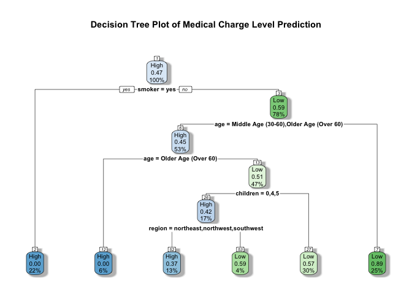

``` r
# The above decision tree plot uses Gini impurity measure to split the nodes.
# The higher the Gini coefficient, the more different instances within the node.

## Use this plot for presentation (clear version)
output_tree_2 <- rpart(charge_level ~ ., data = train_set_dt)
rpart.plot(output_tree_2,
           box.palette="auto",
           shadow.col="gray",
           nn=TRUE,
           type = 3,
           clip.right.labs = FALSE,
           main = "Decision Tree Plot of Medical Charge Level Prediction")
```

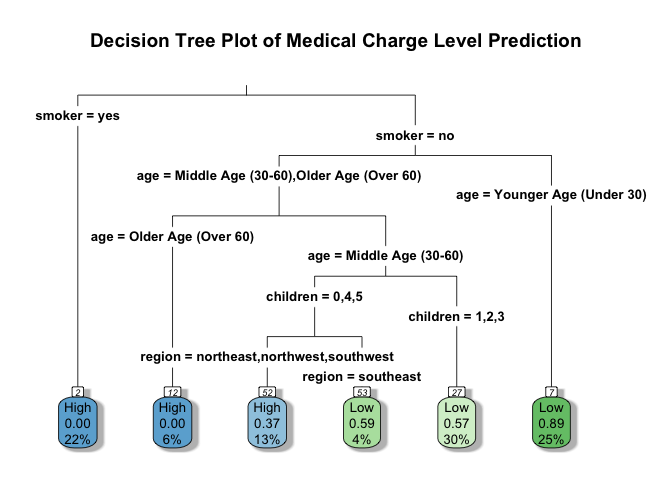

``` r
# Make predictions using the decision tree with testing dataset
predict_dt <- predict(output_tree_1, test_set_dt, type = "class")

cf_DT_ins <- confusionMatrix(as.factor(predict_dt), as.factor(test_labels_dt),
                              mode = "everything")
print(cf_DT_ins)
```

    ## Confusion Matrix and Statistics
    ## 
    ##           Reference
    ## Prediction High Low
    ##       High  125  23
    ##       Low    71 183
    ##                                           
    ##                Accuracy : 0.7662          
    ##                  95% CI : (0.7217, 0.8067)
    ##     No Information Rate : 0.5124          
    ##     P-Value [Acc > NIR] : < 2.2e-16       
    ##                                           
    ##                   Kappa : 0.5293          
    ##                                           
    ##  Mcnemar's Test P-Value : 1.249e-06       
    ##                                           
    ##             Sensitivity : 0.6378          
    ##             Specificity : 0.8883          
    ##          Pos Pred Value : 0.8446          
    ##          Neg Pred Value : 0.7205          
    ##               Precision : 0.8446          
    ##                  Recall : 0.6378          
    ##                      F1 : 0.7267          
    ##              Prevalence : 0.4876          
    ##          Detection Rate : 0.3109          
    ##    Detection Prevalence : 0.3682          
    ##       Balanced Accuracy : 0.7631          
    ##                                           
    ##        'Positive' Class : High            
    ## 

``` r
# Log mean 2 levels: decision tree accuracy = 0.7662, F1 score = 0.7267
```

Build a Prediction Function using Model with Highest Accuracy (Ensemble Model in this case)
-------------------------------------------------------------------------------------------

``` r
pred_med_level <- function(model, a, s, b, c, smo, r){
  pred_level <- predict(model, data.frame(age=as.integer(a),
                                          sex=as.numeric(s),
                                          bmi=as.numeric(b),
                                          children=as.integer(c),
                                          smoker=as.numeric(smo),
                                          region=as.numeric(r)))
  result_info <- paste("A person with age: ",a,", sex (male=1, female=0): ",s,", bmi: ",b,
                       ", children: ",c,", smoker (yes=1, no=0): ",smo,
                       ", region in US (northeast=1, northwest=2, southeast=3, southwest=4): "
                       ,r," is predicted to have a ",pred_level,
                       " medical charge level.",sep="")
  print(result_info)
}

# Example: Using ensemble model because of its high accuracy
pred_med_level(stack_rf, 45, 1, 30, 2, 1, 3)
```

    ## [1] "A person with age: 45, sex (male=1, female=0): 1, bmi: 30, children: 2, smoker (yes=1, no=0): 1, region in US (northeast=1, northwest=2, southeast=3, southwest=4): 3 is predicted to have a High medical charge level."

Appendix 1
----------

References
==========

Wickham et al., (2019). Welcome to the tidyverse. Journal of Open Source
Software, 4(43), 1686,
<a href="https://doi.org/10.21105/joss.01686" class="uri">https://doi.org/10.21105/joss.01686</a>

Hadley Wickham (2019). stringr: Simple, Consistent Wrappers for Common
String Operations. R package version 1.4.0.
<a href="https://CRAN.R-project.org/package=stringr" class="uri">https://CRAN.R-project.org/package=stringr</a>

Elin Waring, Michael Quinn, Amelia McNamara, Eduardo Arino de la Rubia,
Hao Zhu and Shannon Ellis (2020). skimr: Compact and Flexible Summaries
of Data. R package version 2.1.
<a href="https://CRAN.R-project.org/package=skimr" class="uri">https://CRAN.R-project.org/package=skimr</a>

Hadley Wickham, Jim Hester and Romain Francois (2018). readr: Read
Rectangular Text Data. R package version 1.3.1.
<a href="https://CRAN.R-project.org/package=readr" class="uri">https://CRAN.R-project.org/package=readr</a>

David Meyer, Evgenia Dimitriadou, Kurt Hornik, Andreas Weingessel and
Friedrich Leisch (2019). e1071: Misc Functions of the Department of
Statistics, Probability Theory Group (Formerly: E1071), TU Wien. R
package version 1.7-3.
<a href="https://CRAN.R-project.org/package=e1071" class="uri">https://CRAN.R-project.org/package=e1071</a>

Hadley Wickham and Lionel Henry (2020). tidyr: Tidy Messy Data. R
package version 1.0.2.
<a href="https://CRAN.R-project.org/package=tidyr" class="uri">https://CRAN.R-project.org/package=tidyr</a>

Salvatore Mangiafico (2020). rcompanion: Functions to Support Extension
Education Program Evaluation. R package version 2.3.25.
<a href="https://CRAN.R-project.org/package=rcompanion" class="uri">https://CRAN.R-project.org/package=rcompanion</a>

Venables, W. N. & Ripley, B. D. (2002) Modern Applied Statistics with S.
Fourth Edition. Springer, New York. ISBN 0-387-95457-0

Daniel Lüdecke, Dominique Makowski and Philip Waggoner (2020).
performance: Assessment of Regression Models Performance. R package
version 0.4.4.
<a href="https://CRAN.R-project.org/package=performance" class="uri">https://CRAN.R-project.org/package=performance</a>

H. Wickham. ggplot2: Elegant Graphics for Data Analysis. Springer-Verlag
New York, 2016.

Barret Schloerke, Jason Crowley, Di Cook, Francois Briatte, Moritz
Marbach, Edwin Thoen, Amos Elberg and Joseph Larmarange (2018). GGally:
Extension to ‘ggplot2’. R package version 1.4.0.
<a href="https://CRAN.R-project.org/package=GGally" class="uri">https://CRAN.R-project.org/package=GGally</a>

David Robinson and Alex Hayes (2020). broom: Convert Statistical
Analysis Objects into Tidy Tibbles. R package version 0.5.4.
<a href="https://CRAN.R-project.org/package=broom" class="uri">https://CRAN.R-project.org/package=broom</a>

Max Kuhn (2020). caret: Classification and Regression Training. R
package version 6.0-85.
<a href="https://CRAN.R-project.org/package=caret" class="uri">https://CRAN.R-project.org/package=caret</a>

Zachary A. Deane-Mayer and Jared E. Knowles (2019). caretEnsemble:
Ensembles of Caret Models. R package version 2.0.1.
<a href="https://CRAN.R-project.org/package=caretEnsemble" class="uri">https://CRAN.R-project.org/package=caretEnsemble</a>

Torsten Hothorn, Kurt Hornik and Achim Zeileis (2006). Unbiased
Recursive Partitioning: A Conditional Inference Framework. Journal of
Computational and Graphical Statistics, 15(3), 651–674.
